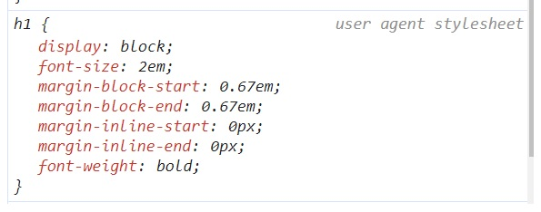

# <abbr title="Cascading Style Sheets">CSS</abbr>

[Classroom](https://classroom.google.com/c/NTg1NzUzMzgzNTUy?cjc=b7odqu5)

## Qué es CSS

__CSS__ es el _acrónimo_ o _abreviatura_ de "Cascade StyleSheet" o su traducción "Hojas de Estilo en Cascada". Se trata de

  un __lenguaje__ usado para definir la __presentación__ de un __documento estructurado__ escrito en __HTML__ o derivados.

__Hojas de estilo__ porque ahí se escriben un conjunto de __reglas__ par aplicar diseño a los documentos (generalmente __HTML__).

En __cascada__ por que hay un determinado orden, __especificidad__, grado de importancia para aplicar los estilos pudiendo sobreescribirse unas a otras. Podemos imaginar la cascada de un río donde el agua desplaza otra masa de agua.

Por tanto se trata de:

- [x] Un lenguaje
- [x] Tiene reglas
- [x] Nos permite diseñar o poner bonito un HTML

## Enlaces recomendados

- [x] [LenguajeCSS](https://lenguajecss.com/) de [MANZ.DEV](https://manz.dev/)
- [x] [Curso de css de Google](https://web.dev/learn/css?hl=es)
- [x] [CSS de mdn](https://developer.mozilla.org/es/docs/Web/CSS)

## Utilizar CSS en HTML

Independientemente de que utices __CSS__ o no los __browsers__ (navegaores) ya tienen integrados sus propias __hojas de estilo__

<figure style="display: flex; flex-wrap: wrap; font-size: 2em;">
  
  <figcaption style="box-sizing: border-box; width: 400px; padding: .5em;background-color: orange">
    Cuando utilizas las <strong>devtools</strong> (herramientas de desarrollo) en la pestaña de estilos podemos ver las reglas que utiliza el <strong>user agent</strong> (navegador)
</figcaption>
</figure>

## Formas de añadir nuestras hojas de estilo en cascada

Existen tres formas de utilizar CSS en un __documento HTML__:


### 1. __CSS inline__. Como su nombre indica dentro de la __etiqueta de apertura__ de un __elemento HTML__ colocar el atributo __style__. Se denomina "CSS interno" puesto que las reglas van dentro del mismo documento HTML. 

```html
<body style="margin: 0;color: #eee">
  <h1>Hello world!</h1>
</body>
```

### 2. Utilizando la __etiqueta__ &lt;style>

```html
<style>
  body {
    margin: 0;
    color: #eee;
  }
</style>
```

Normalmente esta __tag__ la verás dentro del __element__ __head__ pero no hay ningún problema en introducirla dentro del __body__

### 3. Utilizando un archivo externo donde poner nuestro CSS, por tanto, "CSS externo". Para ello existe una etiqueta html denominada "link" donde indicar donde se encuentra nuestro fichero CSS. También tiene que ir en el elemento __head__.

```html
<head>
  <link rel="stylesheet" type="text/css" href="style.css" />
</head>
```

En el fichero css es donde colocaríamos nuestras reglas. Veamos un poco de código en "style.css":

```css
body {
  margin: 0;
  color: #eee;
}
```

## Sintaxis


- El selector apunta al elemento HTML que desea diseñar.
- El bloque de declaración contiene una o más declaraciones separadas por punto y coma. Cada declaración incluye:
  - un nombre de propiedad CSS
  - un valor

Múltiples declaraciones CSS están separadas por punto y coma, y ​​los bloques de declaración están rodeados por llaves.

## Selectores

[Selectores](https://bluuweb.dev/02-css/#selectores)

### Color

  Hay varias formas de obtener un color de fuente

```css
  body {
    color: #00000066; /* Los dos últimos valores marcan la opacidad*/
    color: rgba(0, 0, 0, 50%);
    color: rgb(0 0 0 / 50%); /* Forma moderna de rgb*/
    color: hsl(60, 100%, 100%);
    color: oklch(348 83% 44% / 50%); /*Forma con más colores que los valores anteriores*/
    color: transparent;
  }

  h1 {
    border-width: 2px;
    border-color: currentColor; /*Color de fuente del actual elemento o de un elemento adyacente*/
  }
```
#### Aclaraciones sobre __OKLCH__

  El acrónimo [__OKLCH__](https://developer.mozilla.org/en-US/docs/Web/CSS/color_value/oklch) se refiere a un espacio de color perceptual que fue desarrollado por la compañía __Google__.

  [La función OKLCH](https://lenguajecss.com/css/colores/funcion-lch/)

## Box Model
- [Apuntes del Box Model](https://drive.google.com/file/d/1Yh3GQitJgldK16cjelrtfM4tbsuXEI52/view?usp=sharing)


[Nuevas especificaciones del modelo caja](https://lenguajecss.com/css/modelo-de-cajas/propiedades-logicas-css/)

- [Apuntes de position](https://classroom.google.com/c/NTg1NzUzMzgzNTUy/m/NTkyMzY0MDcwNjg5/details)


- [Repaso de los conceptos nuevos] (https://bluuweb.dev/02-css/02-css-intermedio.html)

## Especificad

[Calculadora de especificidad](https://specificity.keegan.st/)

## Flex box

- [Bloque teórico de Flexbox] (https://classroom.google.com/c/NTg1NzUzMzgzNTUy/m/NTYyOTQ2NTM5NDg2/details)

## Fallback

Un __fallback__ es un valor predeterminado que puede establecerse en tus estilos por si no existe soporte para el valor o propiedad que realmente quieres usar.

En el siguiente ejemplo aprovechamos la __cascada__:

```css
    body {
      text-transform: uppercase;
      color: #b88bc8;
      color: oklch(70% 0.1 317);
    }
```

## Ejercicios

1. Crearemos un html y escribiremos en el documento nuestro famoso "Hello World" dentro de un título de primer nivel (__h1__). Trabajaremos con el __color__ property
  - Utilizaremos un fichero externo llamado "style.css" para poner el __body__ del documento con color de fuente rojo
  - Utilizaremos una etiqueta __style__ para poner el color _tomato_ en la etiqueta __body__ 
  - Utilizaremos __CSS inline__ para poner el color de texto amarillo a la etiqueta body

2. Realizar los 4 primeros ejercicos propuestos por bluuweb

[CSS selectors](https://www.w3schools.com/css/exercise.asp?filename=exercise_selectors1)

3. Realizar el ejercicio de texto del siguiente [enlace](https://github.com/webferrol/css-simple-text)

4. Copia el siguiente código en un archivo __html__

```html
<form action="procesar.php" method="post">
  <label>Usuario</label>  
  <input type="text" id="nombre" name="nombre" placeholder="Nombre de usuario">
  <label>Contraseña</label>  
  <input type="password" id="clave" name="clave" placeholder="Contraseña">  
  <input type="submit" value="Enviar">  
</form>
```
- ¿Qué fallo tiene el formulario de arriba?
- Sin tocar la etiquetas del formulario intenta con CSS obtener el siguiente resultado:


6. Intenta reproducir eh HTML y CSS de la captura que viene a continuación


5. Resuelve este reto:

[Frontend Mentor - Article preview component](https://www.frontendmentor.io/challenges/article-preview-component-dYBN_pYFT)

[Solución](https://github.com/webferrol/article-preview-component-master)

6. [Product preview card component](https://www.frontendmentor.io/challenges/product-preview-card-component-GO7UmttRfa)

[Solución](https://github.com/webferrol/frontend-mentor-product-preview-card)
