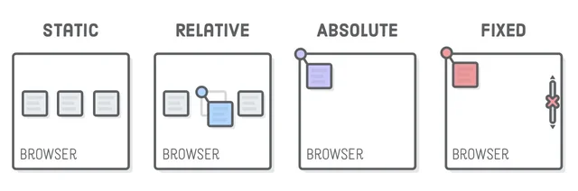
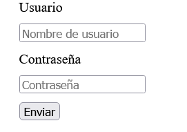
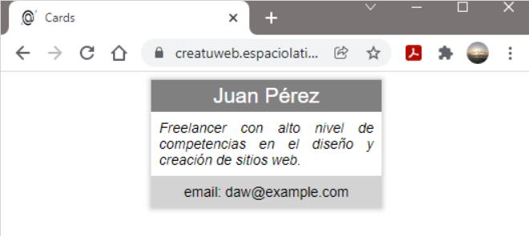

# <abbr title="Cascading Style Sheets">CSS</abbr>

## Qué es CSS

__CSS__ es el _acrónimo_ o _abreviatura_ de "Hojas de estilo en Cascada". Se trata de

  un __lenguaje__ usado para definir la __presentación__ de un __documento estructurado__ escrito en __HTML__ o derivados.

Por tanto se trata de:

- [x] Un lenguaje
- [x] Nos permite diseñar o poner bonito un HTML

## Utilizar CSS en HTML

Existen tres formas de utilizar CSS en un __documento HTML__:

- __CSS inline__. Como su nombre indica dentro de la __etiqueta de apertura__ de un __elemento HTML__ colocar el atributo __style__. Se denomina "CSS interno" puesto que las reglas van dentro del mismo documento HTML. 

```html
<body style="margin: 0;color: #eee">
  <h1>Hello world!</h1>
</body>
```

- Utilizando etiquetas __style__ (normalmente dentro del elemento __head__). También se trata de "CSS interno".

```html
<style>
  body {
    margin: 0;
  }
</style>
```

- Utilizando un archivo externo donde poner nuestro CSS, por tanto, "CSS externo". Para ello existe una etiqueta html denominada "link" donde indicar donde se encuentra nuestro fichero CSS. También tiene que ir en el elemento __head__.

```html
<head>
  <link rel="stylesheet" type="text/css" href="style.css" />
</head>
```

En el fichero css es donde colocaríamos nuestras reglas. Veamos un poco de código en "style.css":

```css
body {
  margin: 0;
  color: #eee;
}
```

## Sintaxis


- El selector apunta al elemento HTML que desea diseñar.
- El bloque de declaración contiene una o más declaraciones separadas por punto y coma. Cada declaración incluye:
  - un nombre de propiedad CSS
  - un valor

Múltiples declaraciones CSS están separadas por punto y coma, y ​​los bloques de declaración están rodeados por llaves.

## Selectores

[Selectores](https://bluuweb.dev/02-css/#selectores)

## Box Model
- [Apuntes del Box Model](https://drive.google.com/file/d/1Yh3GQitJgldK16cjelrtfM4tbsuXEI52/view?usp=sharing)


- [Apuntes de position](https://classroom.google.com/c/NTg1NzUzMzgzNTUy/m/NTkyMzY0MDcwNjg5/details)



- [Repaso de los conceptos nuevos] (https://bluuweb.dev/02-css/02-css-intermedio.html)

## Flex box

- [Bloque teórico de Flexbox] (https://classroom.google.com/c/NTg1NzUzMzgzNTUy/m/NTYyOTQ2NTM5NDg2/details)

## Ejercicios

1. Crearemos un html y escribiremos en el documento nuestro famoso "Hello World" dentro de un título de primer nivel (__h1__). Trabajaremos con el __color__ property
  - Utilizaremos un fichero externo llamado "style.css" para poner el __body__ del documento con color de fuente rojo
  - Utilizaremos una etiqueta __style__ para poner el color _tomato_ en la etiqueta __body__ 
  - Utilizaremos __CSS inline__ para poner el color de texto amarillo a la etiqueta body

2. Realizar los 4 primeros ejercicos propuestos por bluuweb

[CSS selectors](https://www.w3schools.com/css/exercise.asp?filename=exercise_selectors1)

3. Realizar el ejercicio de texto del siguiente [enlace](https://github.com/webferrol/css-simple-text)

4. Copia el siguiente código en un archivo __html__

```html
<form action="procesar.php" method="post">
  <label>Usuario</label>  
  <input type="text" id="nombre" name="nombre" placeholder="Nombre de usuario">
  <label>Contraseña</label>  
  <input type="password" id="clave" name="clave" placeholder="Contraseña">  
  <input type="submit" value="Enviar">  
</form>
```
- ¿Qué fallo tiene el formulario de arriba?
- Sin tocar la etiquetas del formulario intenta con CSS obtener el siguiente resultado:



6. Intenta reproducir eh HTML y CSS de la captura que viene a continuación



5. Resuelve este reto:

[Frontend Mentor - Article preview component](https://www.frontendmentor.io/challenges/article-preview-component-dYBN_pYFT)

[Solución](https://github.com/webferrol/article-preview-component-master)

6. [Product preview card component](https://www.frontendmentor.io/challenges/product-preview-card-component-GO7UmttRfa)

[Solución](https://github.com/webferrol/frontend-mentor-product-preview-card-component-main)

## Sesión siete

- Intentar la instalación de FiraCode
- Grid

6. Challenge[https://www.frontendmentor.io/challenges/intro-component-with-signup-form-5cf91bd49edda32581d28fd1]